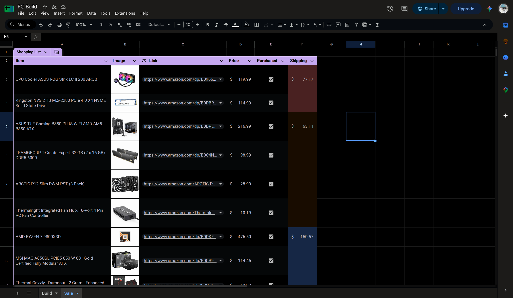
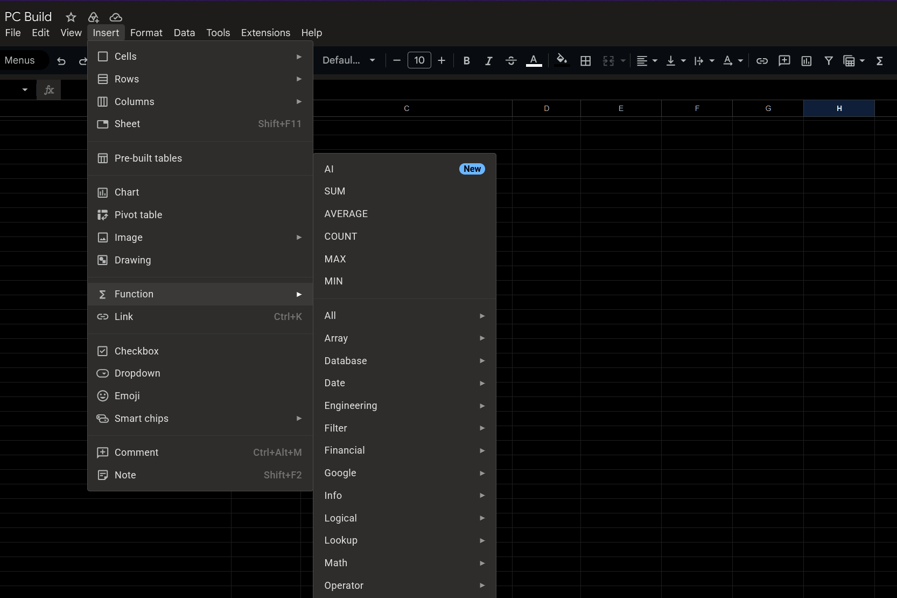

# Google Sheets True Dark

Google Sheets does not have a true dark theme on PC. This small browser add-on gives you one. Menus, toolbars, and the grid all go dark.

Most importantly, images in your sheets stay normal—they don’t turn into negative-looking images like they do with some other userscripts and dark theme extensions.

## How to install

1. Install [Violentmonkey](https://violentmonkey.github.io/) (or another userscript manager) for Chrome, Edge, or Firefox.
2. Click to install:

3. Open a Google Sheet and hard-refresh (`Ctrl` + `Shift` + `R` on Windows, `Cmd` + `Shift` + `R` on Mac).

